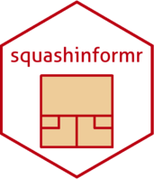

```{r setup, include=FALSE}
library(knitr)

knitr::opts_chunk$set(
  warning = FALSE,
  collapse = TRUE,
  comment = "#>",
  fig.path = "man/figures/",
  out.width = "100%"
)
```

# squashinformr 

<!-- badges: start -->
[](https://github.com/HaydenMacDonald/squashinformr/actions)
<!-- badges: end -->

## Overview

**squashinformr** allows users to easily scrape <a href="http://www.squashinfo.com/" target="_blank">SquashInfo</a> for data on the Professional Squash Association World Tour and other squash tournaments. The functions within this package scrape, parse, and clean data associated with players, tournaments, and rankings.

## Installation

Install the development version of `squashinformr` from this GitHub repository via:

```{r, eval=FALSE}
if (!requireNamespace("remotes")) install.packages("remotes")

remotes::install_github("HaydenMacDonald/squashinformr")
```

## Usage

There are three major families of scraping functions in `squashinformr`:

1. Player functions (`get_players()`, `get_player_*()`) for scraping player profile data
2. Tournament functions (`get_tournaments()`, `get_tournament_*()`) for scraping tournament results data
3. Ranking functions (`get_rankings()` & `get_historical_rankings()`) for scraping current and historical rankings tables

## Examples

### `get_player_recent_matches()`

This function returns a player's recent matches.

```{r}
library(squashinformr)

## Get Mohamed Elshorbagy's most recent match data
get_player_recent_matches(player = "Mohamed Elshorbagy", category = "mens")
```

### `get_player_rankings_history()`

This function returns player ranking histories, given their full names or current PSA ranks and competition category.  

```{r, dpi=300}
library(squashinformr)
library(ggplot2)

## Get the rankings history for the top three women's singles players
top_three <- get_player_rankings_history(rank = 1:3, category = "womens")

ggplot(top_three) +
   geom_line(aes(x = exact_date, y = rank, group = name, colour = name)) +
   scale_y_reverse() +
   theme_light() +
   labs(x = "Date", y = "Rank", colour = "Player")
```

### `get_tournament_games()`

This function returns a tournament's game results data. 

```{r}
library(squashinformr)

## Return game data for 2020's Tournament of Champions.
get_tournament_games("tournament of champions", year = 2020)
```

### `get_rankings()`

This function returns data from the most recent PSA rankings tables. 

```{r}
library(squashinformr)
library(dplyr)

## Get the top 5 players in both men's and women's singles competitions
get_rankings(top = 5, category = "both") %>%
    arrange(category, rank)
```

### `get_matchup()`

This function returns recent head-to-head matchup stats between two players. Stats returned include each player's rank, name, total matches played, number of matches won, the match results spread (relative to player 1), the average match time, the number of games played, the number of games won, average point advantage in a won game, the average point difference in final scores, the number of tie-break wins, and the percentage of games that go to a tie-breaker.

```{r}
library(squashinformr)
library(dplyr)

## Get tidy matchup stats for Paul Coll vs Diego Elias
get_matchup("Paul Coll", "Diego Elias", category = "mens", tidy = TRUE)
```


## Help

Submit issues here on GitHub.  

If you are interested in extending the functionality of this package, fork this repository, make your changes and submit them as a pull request. The `squashinformr` project is released with a <a href="https://github.com/HaydenMacDonald/squashinformr/blob/master/CODE_OF_CONDUCT.md" target="_blank">Contributor Code of Conduct</a>. By contributing to this project, you agree to its terms.  

## Disclaimer

SquashInfo is a valuable resource for the international squash community. By creating and sharing this package, I do not intend to compete with SquashInfo or any of its stakeholders. The `squashinformr` package was created to allow individuals to access data from SquashInfo in an efficient and responsible way, using <a href="https://github.com/dmi3kno/polite" target="_blank">`polite` principles</a>. Following `polite` principles incurs mandatory delays on the scraping process set by SquashInfo. This prevents the use of this package from incurring unnecessary harm to SquashInfo servers via overwhelming requests. Therefore, it is important that users are patient when using this package. SquashInfo currently offers full access to their data and extra features through a premium membership. Please consider <a href="http://www.squashinfo.com/upgrade" target="_blank">signing up and subscribing</a> to SquashInfo to support their work.

## Author

This package was authored by Hayden MacDonald. Feel free to email me at hayden.macdonald.8778 [at] gmail.com. 

## License

The `squashinformr` package is licensed under the <a href="https://github.com/HaydenMacDonald/squashinformr/blob/master/LICENSE" target="_blank">MIT LICENSE</a>.

