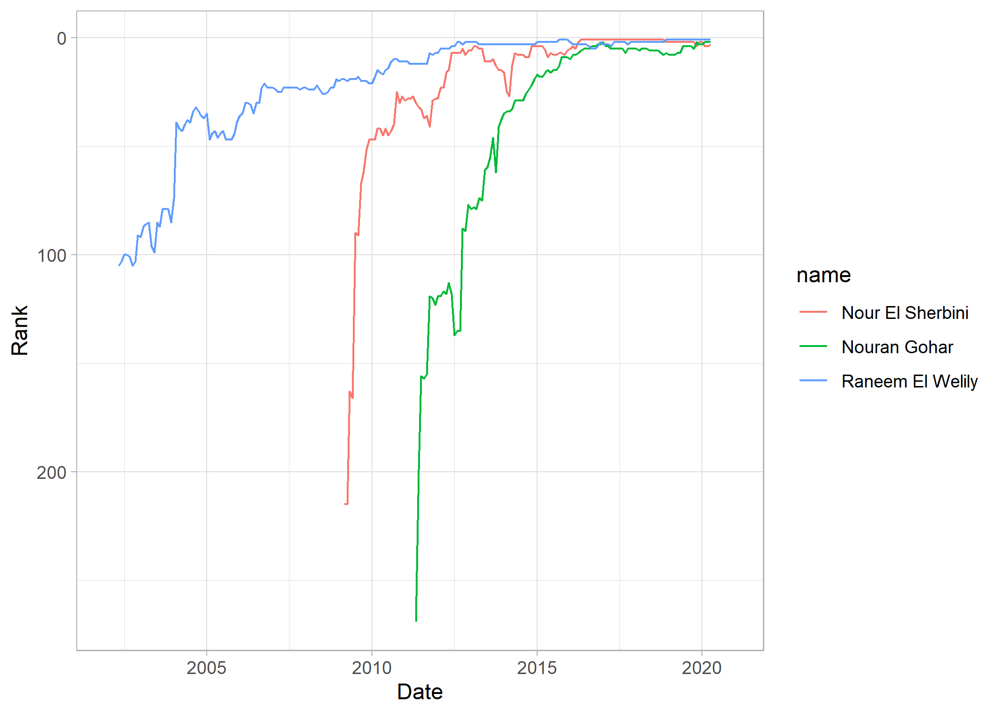

# squashinformr 

<!-- badges: start -->

[](https://github.com/HaydenMacDonald/squashinformr/actions)
[](https://github.com/HaydenMacDonald/squashinformr/actions)
[](https://ci.appveyor.com/project/HaydenMacDonald/squashinformr)
<!-- badges: end -->

## Overview

**squashinformr** allows users to easily scrape
<a href="http://www.squashinfo.com/" target="_blank">SquashInfo</a> for
data on the Professional Squash Association World Tour and other squash
tournaments. The functions within this package scrape, parse, and clean
data associated with players, tournaments, and rankings.

## Installation

Install the development version of `squashinformr` from this GitHub
repository via:

## Usage

There are three major families of scraping functions in `squashinformr`:

1.  Player functions (`get_players()`, `get_player_*()`) for scraping
    player profile data
2.  Tournament functions (`get_tournaments()`, `get_tournament_*()`) for
    scraping tournament results data
3.  Ranking functions (`get_rankings()` & `get_historical_rankings()`)
    for scraping current and historical rankings tables

## Examples

### `get_player_recent_matches()`

This function returns a player’s recent matches.

``` r
library(squashinformr)

## Get Mohamed Elshorbagy's most recent match data
get_player_recent_matches(player = "Mohamed Elshorbagy", category = "mens")
#> Scraping http://www.squashinfo.com/rankings/men/1
#> Scraping Mohamed Elshorbagy's profile
#> # A tibble: 75 x 12
#>     rank player opponent result games_won games_lost match_time round date      
#>    <int> <chr>  <chr>    <chr>      <dbl>      <dbl>      <dbl> <chr> <date>    
#>  1     1 Moham… Ali Far… W              3          1         79 F     2020-03-01
#>  2     1 Moham… Tarek M… W              3          1         49 SF    2020-03-01
#>  3     1 Moham… Saurav … W              2          1         51 QF    2020-03-01
#>  4     1 Moham… Mathieu… W              2          1         48 R2    2020-03-01
#>  5     1 Moham… Paul Co… L              0          3         51 QF    2020-03-01
#>  6     1 Moham… Mazen H… W             NA         NA         NA R3    2020-03-01
#>  7     1 Moham… Daryl S… W              3          0         30 R2    2020-03-01
#>  8     1 Moham… Paul Co… L              1          2         NA -     2020-02-01
#>  9     1 Moham… Peter C… W              2          0         NA -     2020-01-01
#> 10     1 Moham… Tarek M… W              3          1         76 F     2020-01-01
#> # … with 65 more rows, and 3 more variables: event <chr>, country <chr>,
#> #   psa <chr>
```

### `get_player_rankings_history()`

This function returns player ranking histories, given their full names
or current PSA ranks and competition category.

``` r
library(squashinformr)
library(ggplot2)

## Get the rankings history for the top three women's singles players
top_three <- get_player_rankings_history(rank = 1:3, category = "womens")
#> Scraping Raneem El Welily's ranking history
#> Scraping Nouran Gohar's ranking history
#> Scraping Nour El Sherbini's ranking history

ggplot(top_three) +
   geom_line(aes(x = exact_date, y = rank, group = name, colour = name)) +
   scale_y_reverse() +
   theme_light() +
   labs(x = "Date", y = "Rank", colour = "Player")
```



### `get_tournament_games()`

This function returns a tournament’s game results data.

``` r
library(squashinformr)

## Return game data for 2020's Tournament of Champions.
get_tournament_games("tournament of champions", year = 2020)
#> Scraping http://www.squashinfo.com/results?start=1
#> Scraping http://www.squashinfo.com/results?start=2
#> Scraping http://www.squashinfo.com/results?start=3
#> Scraping http://www.squashinfo.com/results?start=4
#> Scraping http://www.squashinfo.com/results?start=5
#> Scraping http://www.squashinfo.com/events/8367-mens-tournament-of-champions-2020
#> Scraping http://www.squashinfo.com/events/8368-womens-tournament-of-champions-2020
#> # A tibble: 388 x 15
#>    tournament_name category tournament_date round match  game player_1 player_2
#>    <chr>           <chr>    <date>          <ord> <int> <int> <chr>    <chr>   
#>  1 JP Morgan Tour… Men's    2020-01-17      F        64     4 Mohamed… Tarek M…
#>  2 JP Morgan Tour… Men's    2020-01-17      F        64     3 Mohamed… Tarek M…
#>  3 JP Morgan Tour… Men's    2020-01-17      F        64     2 Mohamed… Tarek M…
#>  4 JP Morgan Tour… Men's    2020-01-17      F        64     1 Mohamed… Tarek M…
#>  5 JP Morgan Tour… Women's  2020-01-17      F        62     3 Camille… Nour El…
#>  6 JP Morgan Tour… Women's  2020-01-17      F        62     2 Camille… Nour El…
#>  7 JP Morgan Tour… Women's  2020-01-17      F        62     1 Camille… Nour El…
#>  8 JP Morgan Tour… Men's    2020-01-17      SF       63     5 Tarek M… Ali Far…
#>  9 JP Morgan Tour… Men's    2020-01-17      SF       63     4 Tarek M… Ali Far…
#> 10 JP Morgan Tour… Men's    2020-01-17      SF       63     3 Tarek M… Ali Far…
#> # … with 378 more rows, and 7 more variables: game_winner <chr>,
#> #   player_1_score <dbl>, player_2_score <dbl>, player_1_seed <dbl>,
#> #   player_2_seed <dbl>, player_1_nationality <chr>, player_2_nationality <chr>
```

### `get_rankings()`

This function returns data from the most recent PSA rankings tables.

``` r
library(squashinformr)
library(dplyr)
#> 
#> Attaching package: 'dplyr'
#> The following objects are masked from 'package:stats':
#> 
#>     filter, lag
#> The following objects are masked from 'package:base':
#> 
#>     intersect, setdiff, setequal, union

## Get the top 5 players in both men's and women's singles competitions
get_rankings(top = 5, category = "both") %>%
    arrange(category, rank)
#> # A tibble: 10 x 7
#>     rank previous_rank name          highest_ranking hwr_date   country category
#>    <int>         <int> <chr>                   <int> <date>     <chr>   <chr>   
#>  1     1             1 Mohamed Elsh…               1 2014-11-01 EGY     Men's   
#>  2     2             2 Ali Farag                   1 2019-03-01 EGY     Men's   
#>  3     3             4 Karim Abdel …               1 2017-05-01 EGY     Men's   
#>  4     4             3 Tarek Momen                 3 2019-02-01 EGY     Men's   
#>  5     5             5 Paul Coll                   5 2019-04-01 NZL     Men's   
#>  6     1             1 Raneem El We…               1 2015-09-01 EGY     Women's 
#>  7     2             2 Nouran Gohar                2 2017-01-01 EGY     Women's 
#>  8     3             4 Nour El Sher…               1 2016-05-01 EGY     Women's 
#>  9     4             3 Camille Serme               2 2017-02-01 FRA     Women's 
#> 10     5             5 Nour El Tayeb               3 2018-02-01 EGY     Women's
```

### `get_matchup()`

This function returns recent head-to-head matchup stats between two
players. Stats returned include each player’s rank, name, total matches
played, number of matches won, the match results spread (relative to
player 1), the average match time, the number of games played, the
number of games won, average point advantage in a won game, the average
point difference in final scores, the number of tie-break wins, and the
percentage of games that go to a tie-breaker.

``` r
library(squashinformr)
library(dplyr)

## Get tidy matchup stats for Paul Coll vs Diego Elias
get_matchup("Paul Coll", "Diego Elias", category = "mens", tidy = TRUE)
#> Scraping http://www.squashinfo.com/rankings/men/1
#> Scraping Paul Coll's profile
#> Scraping Diego Elias's profile
#> # A tibble: 1 x 23
#>   player_1_rank player_1 player_2_rank player_2 matches_played player_1_matche…
#>           <int> <chr>            <int> <chr>             <int>            <int>
#> 1             5 Paul Co…             6 Diego E…              2                1
#> # … with 17 more variables: player_2_matches_won <int>, matches_3_2 <int>,
#> #   match_3_1 <int>, match_3_0 <int>, match_0_3 <int>, match_1_3 <int>,
#> #   match_2_3 <int>, avg_match_time <dbl>, games_played <int>,
#> #   player_1_games_won <int>, player_2_games_won <int>,
#> #   player_1_avg_advantage <dbl>, player_2_avg_advantage <dbl>,
#> #   avg_point_diff <dbl>, player_1_tiebreak_wins <int>,
#> #   player_2_tiebreak_wins <int>, pct_games_tiebreak <dbl>
```

## Help

Submit issues here on GitHub.

If you are interested in extending the functionality of this package,
fork this repository, make your changes and submit them as a pull
request. The `squashinformr` project is released with a
<a href="https://github.com/HaydenMacDonald/squashinformr/blob/master/CODE_OF_CONDUCT.md" target="_blank">Contributor
Code of Conduct</a>. By contributing to this project, you agree to its
terms.

## Disclaimer

SquashInfo is a valuable resource for the international squash
community. By creating and sharing this package, I do not intend to
compete with SquashInfo or any of its stakeholders. The `squashinformr`
package was created to allow individuals to access data from SquashInfo
in an efficient and responsible way, using
<a href="https://github.com/dmi3kno/polite" target="_blank">`polite`
principles</a>. Following `polite` principles incurs mandatory delays on
the scraping process set by SquashInfo. This prevents the use of this
package from incurring unnecessary harm to SquashInfo servers via
overwhelming requests. Therefore, it is important that users are patient
when using this package. SquashInfo currently offers full access to
their data and extra features through a premium membership. Please
consider
<a href="http://www.squashinfo.com/upgrade" target="_blank">signing up
and subscribing</a> to SquashInfo to support their work.

## Author

This package was authored by Hayden MacDonald. Feel free to email me at
hayden.macdonald.8778 \[at\] gmail.com.

## License

The `squashinformr` package is licensed under the
<a href="https://github.com/HaydenMacDonald/squashinformr/blob/master/LICENSE" target="_blank">MIT
LICENSE</a>.
